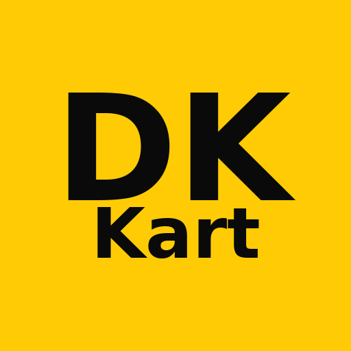

# DK Kart

> Karting setup & telemetry tracker — open source



**DK Kart** is a Progressive Web App (PWA) for karting teams to track setup
parameters, import telemetry data from multiple devices, and get
engine-class-specific recommendations.

## Features

### 🏎️ Multi-device telemetry import
- **AiM MyChron** 5 / 5S / 5S 2T (Race Studio CSV export) ✓ Supported
- **Alfano** 6 / 7 / Astro ✓ Supported
- **RaceChrono** Pro (mobile) ✓ Supported
- **RaceCapture/Pro** ✓ Supported
- **Unipro** Laptimer 7003 ✓ Supported
- Generic CSV fallback for other devices

### 🔧 Engine-aware analysis
Supports detailed metadata for:
- Rotax MAX (Senior, Junior, Mini, Micro, DD2)
- IAME X30 (Senior, Junior, Mini), KA100
- Vortex ROK (GP, Shifter, Mini, VLR)
- TM (KZ R1/R2, OK, OKJ)
- Briggs LO206 (Senior, Junior, Cadet)
- Tillotson T225 RS, T196 R
- Honda GX-series

Algorithms automatically adapt to your engine class:
- 2-stroke vs 4-stroke (different fuel analysis)
- Single-speed vs shifter (different brake setup)
- Peak power RPM zones per engine
- Rebuild intervals per category

### 🔍 16 built-in algorithms
- Tire pressure delta and condition-based recommendations
- Water temperature optimization
- EGT analysis (2-stroke)
- RPM peak power zone matching
- Gear ratio calculator
- Braking force assessment by category
- Tire surface temperature balance (4 tires × 3 points)
- Weight balance (corner scales)
- Camber suggestions from tire temps
- Driving style detection (pedal vs steering)
- Consistency analysis
- Tire heat cycle sweet spot
- Engine hours / rebuild scheduling
- Air density / jet correction
- Anomaly detection across sessions
- Brake system diagnostics

### 📊 Session comparison
- Side-by-side comparison of any two sessions
- Anomaly detection: catches sudden changes vs historical baseline
- Visual lap time history

### 🔒 Privacy-first sharing
- **All data stays on your device** — no cloud, no servers
- Training sessions are **always private**
- Only after marking a session as **"Race event / Etapas"**, you get a share button
- Sharing creates a `.dkkart-share.json` file you can send via any channel (email, Telegram, etc.)
- Received sessions appear in a separate "Colleagues' sessions" section as read-only

This means competitive setup details remain yours during testing, but lessons
from race events can flow back to the karting community.

### 🛞 Setup tracking
- Tire pressure (cold/hot, front/rear)
- Tire brand, heat cycles, surface temperatures
- Chassis (toe, camber, caster, track width)
- Carburetor (main jet, needle position, air screw)
- Brake system (compound, thickness, glazing, fluid age)
- Seat position and supports
- Weight balance (4-wheel corner scales)

## Quick start

### Use the hosted version

[https://dkkart.vercel.app](https://dkkart.vercel.app) _(coming soon)_

### Run locally

```bash
git clone https://github.com/YOUR_USERNAME/dk-kart.git
cd dk-kart
npm install
npm run dev
```

### Deploy to Vercel

1. Fork this repository
2. Connect to Vercel
3. Deploy with default settings

## Install on phone (PWA)

**iPhone:**
1. Open the app URL in Safari
2. Tap Share → Add to Home Screen
3. Name: "DK Kart"

**Android:**
1. Open in Chrome
2. Menu → Install app

## Contributing

We welcome contributions! Especially:
- Sample CSV files from devices we don't yet support
- Engine metadata for missing categories
- Track GPS data for your home circuit
- Translations

See [CONTRIBUTING.md](CONTRIBUTING.md) for details.

## Tech stack

- **React 18** (Vite build)
- **Recharts** for visualizations
- **PWA** with service worker (offline-capable)
- **LocalStorage** for data persistence
- No backend (yet) — all data stays on your device

## License

MIT — free to use, modify, and distribute.

## Acknowledgments

Built initially by the DK Kart team for tracking development of young karting
drivers. Contributions from the wider karting community welcome.
